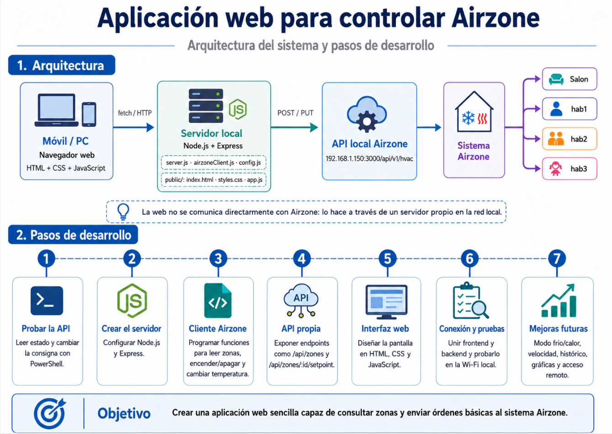

## Proyecto: aplicación web para controlar un sistema de climatización zonificado

Se propone desarrollar una aplicación web básica que permita consultar y controlar un sistema de climatización por zonas mediante una API local.

La aplicación tendrá una interfaz sencilla creada con **HTML, CSS y JavaScript**, desde la que el usuario podrá seleccionar una zona de la vivienda, consultar su estado actual y modificar algunos parámetros básicos de funcionamiento.

El servidor se desarrollará con **Node.js y Express**. Su función será actuar como intermediario entre la página web y la API local del sistema de climatización. De esta forma, el navegador no se comunicará directamente con el dispositivo, sino con nuestro propio servidor.

La arquitectura general será la siguiente:

```text
Navegador web
HTML + CSS + JavaScript
        ↓
Servidor Node.js + Express
        ↓
API local del sistema de climatización
        ↓
Zonas de la vivienda
```



La aplicación deberá permitir, al menos:

```text
- Mostrar las zonas disponibles.
- Seleccionar una zona.
- Consultar si la zona está encendida o apagada.
- Mostrar la temperatura actual de la zona.
- Mostrar la temperatura de consigna.
- Encender o apagar una zona.
- Subir o bajar la temperatura de consigna.
- Mostrar si la zona está demandando frío o calor.
```

El proyecto se organizará separando claramente la parte cliente y la parte servidor:

```text
airzone-web/
│
├── server.js
├── airzoneClient.js
├── config.js
│
└── public/
    ├── index.html
    ├── styles.css
    └── app.js
```

El archivo `server.js` contendrá el servidor Express.
El archivo `airzoneClient.js` contendrá las funciones necesarias para comunicarse con la API local.
El archivo `config.js` almacenará los datos de configuración del sistema.
La carpeta `public/` contendrá la interfaz web visible para el usuario.

La primera versión del proyecto funcionará únicamente dentro de la red local. El objetivo principal será comprobar que una aplicación web propia puede leer el estado de las zonas y enviar órdenes básicas al sistema de climatización.
